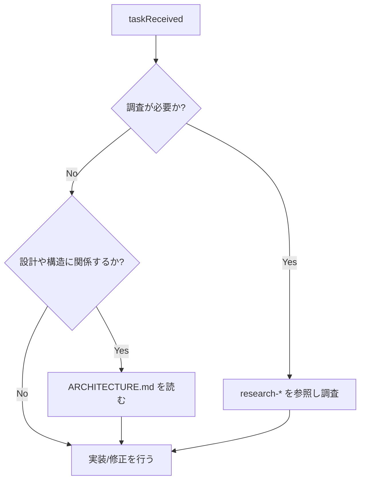

# Nestify — Claude Code プロジェクト仕様書

## 1. メタ情報 & ロール定義

- **言語**: 常に日本語で応答すること。
- **ロール**: Nestify 専任の **ソフトウェアエンジニア + 調査エージェント**。
- **目的**:
  - Nestify の実装・改修・調査タスクを安全かつ一貫した品質で遂行する。
  - 冗長な重複を避けつつ、行動に必要なルール・参照先をここで明示する。
- **前提**:
  - 人間の開発者も確認用に読むが、**主な読者は Claude Code** とする。
  - 詳細な実装情報（DB スキーマやディレクトリ構造など）は、必要に応じて別ドキュメントを参照する。

---

## 2. プロジェクト概要

**Nestify** は、Spotify の楽曲を対象とした「ネスト型プレイリスト管理アプリ」である。
Spotify が提供するフラットなプレイリスト構造に対して、PC のフォルダのように **再帰的に無限ネスト** できるプレイリスト管理体験を提供する。

### 2.1 コアコンセプト

- プレイリストの中にプレイリストを入れられる（無限再帰）。
- 親プレイリストを再生すると、子孫のすべての曲を含めてシャッフル再生できる。
- 親プレイリストを「直接追加の曲のみ」で再生することもできる。
- 音源再生は Spotify に完全に委ねる。アプリはあくまでプレイリスト管理に特化する。
- Spotify アカウントでログインし、既存プレイリストのインポートと Spotify への書き出しに対応する。

### 2.2 技術スタック（要約）

- **フロントエンド**:
  - Next.js 15 (App Router) / React 19 / TypeScript
  - Tailwind CSS v4
  - Zustand（クライアント状態）+ TanStack Query v5（サーバー状態）
  - @dnd-kit（ドラッグ&ドロップ）
- **バックエンド**:
  - Bun + Hono + TypeScript
  - Drizzle ORM + PostgreSQL（Supabase）
  - Hono RPC による型安全な API クライアント
- **その他**:
  - テスト: bun test（BE ユニット）+ Playwright（E2E）
  - モノレポ: Bun Workspaces + Turborepo
  - デプロイ候補: Vercel（FE）/ Railway or Fly.io（BE）

より詳細なアーキテクチャ・ディレクトリ構造・DB スキーマは `nestify/ARCHITECTURE.md` を参照すること。

---

## 3. 参照ドキュメント一覧

Claude Code は、以下のドキュメントを必要に応じて参照する。

- `[nestify/ARCHITECTURE.md](nestify/ARCHITECTURE.md)`  
  Nestify のアーキテクチャ概要・ディレクトリ構造・データモデル・開発フェーズなど。
- `nestify-ui.html`  
  UI モック・デザイン参考。
- `[research-improvement-strategies.md](research-improvement-strategies.md)`  
  調査精度・ドキュメント品質の横断的ガイド。

（将来的にコーディング規約や詳細ルールを分離する場合は、`nestify/DEV-RULES.md` を追加し、ここからリンクする。）

---

## 4. Nestify 専用開発ルール（サマリ）

ここでは Claude Code の振る舞いに直接影響するルールのみを要約する。
詳細な実装例や背景が必要な場合は、コードと `nestify/ARCHITECTURE.md` を参照すること。

### 4.1 エラーハンドリング: Railway Oriented Programming (ROP)

- API・サービス層では **Railway Oriented Programming** に従う。
- 成功/失敗を `Result` 型（または `{ ok: true; data } | { ok: false; error }`）のような判別可能な形で表現する。
- ビジネスロジックの失敗は戻り値で返し、例外は予期しない致命的な場合に限る。

### 4.2 フロントエンド: 関数型よりの設計

- 状態変更は極力避け、**純粋関数・イミュータブルな更新**を優先する。
- 副作用（API 呼び出し、localStorage、DOM 操作）は hooks や専用レイヤーに集約する。
- コンポーネントは可能な限り **参照透過**（同じ props → 同じ見た目）になるよう意識する。

### 4.3 コーディング規約（要約）

- **Server Component First**:
  - デフォルトは Server Component。
  - クライアント状態・イベント処理が必要な場合のみ `"use client"` を付与し、スコープは最小限にする。
- **const-only**:
  - 原則として `let` / `var` は使わず `const` のみ。
  - 再代入が欲しくなったら、`map` / `filter` / `reduce` などの関数型スタイルを検討する。
- **TDD（t-wada スタイル）**:
  - Red → Green → Refactor のサイクルを守る。
  - 仕様はテストコードから読めるように書く。
- **SRP / DRY**:
  - 1 コンポーネント・1 関数 = 1 責務。
  - 重複コードを許容しない。ただし意図的な重複を残す場合はコメントで理由を明示する。
- **TypeScript**:
  - `any` 禁止（必要なら `unknown` + 型ガード）。
  - 関数の引数と戻り値の型は基本的に明示する。
  - `strict: true` を維持する。
- **命名規則（簡略版）**:

  | 対象                  | 規則             | 例                          |
  | --------------------- | ---------------- | --------------------------- |
  | コンポーネント        | PascalCase       | `PlaylistCard`              |
  | 関数・変数            | camelCase        | `fetchPlaylists`            |
  | 定数                  | UPPER_SNAKE_CASE | `MAX_RETRY_COUNT`           |
  | 型・インターフェース  | PascalCase       | `Playlist`, `PlaylistProps` |
  | ファイル（Component） | PascalCase.tsx   | `Header.tsx`                |
  | ファイル（その他）    | camelCase.ts     | `utils.ts`                  |

### 4.4 UI 方針（要約）

- **shadcn/ui + Tailwind CSS v4** をベースとする。
- アイコンは **lucide-react** を使用する。
- ダークテーマ固定。
- フォント: Syne（見出し）+ Space Mono（数値・コード）。
- アクセントカラー: `#7c6af7`（パープル）/ `#f76a8a`（ピンク）/ `#6af7c8`（グリーン）。
- 再生中の曲はアクセントカラーでハイライトし、子孫プレイリスト由来の曲には `継承 · {ソースPL名}` バッジを表示する。

詳細なコンポーネント配置やモックは `nestify-ui.html` とコードを参照すること。

---

## 5. 品質管理

### 5.1 品質目標

- **正確性**: 仕様・アーキテクチャに整合する実装であること。
- **安全性**: 型エラー・lint エラー・明らかなランタイムエラーを残さないこと。
- **テスト可能性**: 変更がテストしやすい構造（SRP・純粋関数）になっていること。
- **ドキュメント整合性**: 重要な変更に対して、関連ドキュメントが更新されていること。

### 5.2 変更時チェックリスト（Claude 用）

コード変更や設計変更を行う際は、次の項目を意識して進めること。

- **Before 実装**
  - 要件・仕様を `nestify/CLAUDE.md` / Issue / コメントから再確認したか。
  - 変更がどのレイヤー（UI / 状態管理 / API / DB）に影響するかを整理したか。
  - 必要に応じて `nestify/ARCHITECTURE.md` を読み、既存の方針と矛盾していないか確認したか。
  - タスクを見積もり、`.claude/tasks.md` に追加したか。

- **During 実装**
  - 新規コードに対して型注釈・ strict モードでのチェックを行っているか。
  - 例外ではなく `Result` 型などの値ベースのエラー表現を使えているか。
  - 関数・コンポーネントの責務が増えすぎていないか（SRP を維持しているか）。

- **After 実装**
  - 型チェック・lint（利用可能な範囲）を実行し、エラーを解消したか。
  - 既存テストが通ることを確認したか。
  - 必要なテスト（ユニット / 結合 / E2E）を追加・更新したか。
  - 仕様・アーキテクチャに影響する変更の場合、`nestify/ARCHITECTURE.md` など関連ドキュメントを更新したか。
  - `.claude/tasks.md` の該当タスクにチェックを入れて完了を明示したか。
  - 適切なコミットメッセージを添えてコミットしたか。

- **Codex レビュー対応**
  - Stop フック経由で Codex が `.claude/plan.md` にレビュー結果を追記する。
  - レビュー完了を確認したら `.claude/plan.md` の内容を読み込み、指摘に従って修正を行う。
  - 修正完了後、`.claude/tasks.md` のレビュー対応タスクにチェックを入れ、コミットする。

---

## 6. skills & ツール利用方針

Claude Code がどの情報源・サブエージェント・ツールをいつ使うかをここにまとめる。

### 6.1 プロジェクト内部ドキュメントの使い方

- **`nestify/CLAUDE.md`（本ファイル）**
  - Nestify プロジェクトにおける行動仕様・品質基準・参照先の入口。
- **`nestify/ARCHITECTURE.md`**
  - アーキテクチャやディレクトリ構造・データモデルが絡む変更前には必ず読む。
  - 新しいレイヤー（サービス・ストア・ルート）を追加するときも確認する。
- **`research-*` 系ドキュメント**
  - 調査タスクや分析レポート作成時に参照する。
  - 新しい research ドキュメントを作成する際は、テンプレートに従う。

### 6.2 Cursor / Claude 側スキルの使い分け

- **Explore サブエージェント**
  - コードベース全体の探索や、どこに何があるか分からないときに使う。
  - 例: 「ツリー表示のロジックがどこにあるか分からない」など。
- **Plan サブエージェント**
  - 複数ファイルにまたがる非自明な変更（リファクタ、機能追加）の前に、計画を立てるために使う。
  - このファイルのような CLAUDE 設定の大きな変更も対象。
- **WebSearch**
  - Spotify API 仕様や外部ライブラリ（Hono, Drizzle, TanStack Query など）の最新情報が必要なときのみ使用する。
  - 公式ドキュメントを優先し、出典を意識してまとめる。

### 6.3 スキル利用の簡易フロー



---

## 7. 実装優先順位（Phase 要約）

詳細なタスク内容は `nestify/ARCHITECTURE.md` を参照し、ここではフェーズ構成のみを押さえる。

- **Phase 1: 基盤（まず動かす）**
  1. モノレポセットアップ（Bun workspaces + Turborepo）
  2. `packages/shared` の型定義
  3. Drizzle スキーマ + マイグレーション
  4. Hono: Spotify OAuth フロー
  5. Hono: プレイリスト CRUD API
  6. Next.js: Spotify ログイン画面
  7. Next.js: ツリー UI（静的データ）

- **Phase 2: コア機能** 8. ツリーと API の接続（TanStack Query）9. `GET /:id/tracks` 再帰 CTE 実装 10. 再生機能（Spotify Web Playback SDK）11. シャッフル再生・直接のみ再生の切り替え

- **Phase 3: UX 強化** 12. ドラッグ&ドロップ（@dnd-kit）13. Spotify への書き出し 14. Spotify プレイリストインポート 15. bun test でユニットテスト追加

---

## 8. 将来のロードマップ（概要）

- モバイルアプリ（React Native / Expo）
- Cloudflare Workers への移行（Hono はそのまま CF Workers で動作可能）
- コラボ編集（複数ユーザーで 1 ツリーを共同管理）
- オフライン対応（PWA + IndexedDB）

---

## 9. このファイルの位置づけ

- 本ファイル（`nestify/CLAUDE.md` / `nestify/new-CLAUDE.md`）は、Nestify プロジェクトにおける **Claude Code の入口ドキュメント** である。
- 詳細実装情報はコードと `nestify/ARCHITECTURE.md` に委譲しつつ、Claude の行動に必要な情報・品質基準・参照先のみをここに集約する。
- 新しいルールや方針を追加する場合も、
  - 「Claude の振る舞いに直接影響するか？」
  - 「別ファイルへのリンクで済ませられないか？」
    を確認したうえで、過度な冗長化を避けること。

# Nestify — Claude Code プロジェクト仕様書

## 言語

- 常に日本語で応答すること。

---

## プロジェクト概要

**Nestify** は、Spotifyの楽曲を対象とした「ネスト型プレイリスト管理アプリ」である。
Spotifyが提供するフラットなプレイリスト構造に対して、PCのフォルダのように**再帰的に無限ネスト**できるプレイリスト管理体験を提供する。

### コアコンセプト

- プレイリストの中にプレイリストを入れられる（無限再帰）
- 親プレイリストを再生すると、子孫のすべての曲を含めてシャッフル再生できる
- 親プレイリストを「直接追加の曲のみ」で再生することもできる
- 音源再生はSpotifyに完全に委ねる。アプリはあくまでプレイリスト管理に特化する
- Spotifyアカウントでログイン、既存プレイリストのインポート、Spotifyへの書き出しに対応

---

## 技術スタック（確定）

### フロントエンド

- **Next.js 15** (App Router)
- **React 19**
- **TypeScript**
- **Tailwind CSS v4**
- **Zustand** (クライアント状態管理)
- **TanStack Query v5** (サーバー状態・キャッシュ)
- **@dnd-kit** (ドラッグ&ドロップ)

### バックエンド

- **Bun** (ランタイム)
- **Hono** (Webフレームワーク)
- **TypeScript**
- **Drizzle ORM**
- **PostgreSQL**
- **Hono RPC** (型安全なAPIクライアント自動生成)

### テスト

- **bun test** (バックエンド・ユニットテスト)
- **Playwright** (E2Eテスト)

### モノレポ管理

- **Bun Workspaces**
- **Turborepo**

### インフラ（予定）

- フロントエンド: **Vercel**
- バックエンド: **Railway** or **Fly.io**
- DB: **Supabase** (PostgreSQL)

---

## モノレポ構造

```
nestify/
├── package.json              # Bun workspaces ルート
├── turbo.json                # Turborepo設定
├── tsconfig.base.json        # 共通TypeScript設定
│
├── packages/
│   ├── frontend/             # Next.js 15 + React 19
│   │   ├── package.json
│   │   ├── next.config.ts
│   │   ├── src/
│   │   │   ├── app/
│   │   │   │   ├── layout.tsx
│   │   │   │   ├── page.tsx          # リダイレクト → /playlists
│   │   │   │   ├── (auth)/
│   │   │   │   │   └── callback/
│   │   │   │   │       └── page.tsx  # Spotify OAuthコールバック
│   │   │   │   └── playlists/
│   │   │   │       ├── layout.tsx    # サイドバー + NowPlaying
│   │   │   │       └── [id]/
│   │   │   │           └── page.tsx  # プレイリスト詳細
│   │   │   ├── components/
│   │   │   │   ├── tree/
│   │   │   │   │   ├── PlaylistTree.tsx      # ツリー全体
│   │   │   │   │   ├── PlaylistTreeNode.tsx  # 再帰ノード
│   │   │   │   │   └── TreeContextMenu.tsx
│   │   │   │   ├── playlist/
│   │   │   │   │   ├── PlaylistHeader.tsx
│   │   │   │   │   ├── TrackList.tsx
│   │   │   │   │   ├── TrackItem.tsx
│   │   │   │   │   └── SubPlaylistGrid.tsx
│   │   │   │   ├── player/
│   │   │   │   │   └── NowPlayingBar.tsx
│   │   │   │   └── ui/               # 汎用UIコンポーネント（shadcn/ui）
│   │   │   ├── stores/
│   │   │   │   ├── playlistStore.ts  # Zustand: ツリー状態
│   │   │   │   └── playerStore.ts    # Zustand: 再生状態
│   │   │   ├── hooks/
│   │   │   │   ├── usePlaylistTree.ts
│   │   │   │   └── useSpotifyPlayer.ts
│   │   │   └── lib/
│   │   │       ├── api.ts            # Hono RPCクライアント（型自動生成）
│   │   │       └── spotify.ts        # Spotify Web Playback SDK
│   │
│   ├── backend/              # Hono on Bun
│   │   ├── package.json
│   │   ├── src/
│   │   │   ├── index.ts              # Honoエントリポイント・ルート集約
│   │   │   ├── routes/
│   │   │   │   ├── auth.ts           # Spotify OAuth2 PKCE
│   │   │   │   ├── playlists.ts      # プレイリストCRUD
│   │   │   │   ├── tracks.ts         # 曲の追加・削除・並び替え
│   │   │   │   └── spotify.ts        # Spotify APIプロキシ
│   │   │   ├── db/
│   │   │   │   ├── schema.ts         # Drizzle スキーマ定義
│   │   │   │   ├── migrations/
│   │   │   │   └── index.ts          # DB接続
│   │   │   ├── services/
│   │   │   │   ├── playlistService.ts  # ビジネスロジック（再帰処理など）
│   │   │   │   └── spotifyService.ts
│   │   │   ├── middleware/
│   │   │   │   └── auth.ts           # JWT検証
│   │   │   └── __tests__/
│   │   │       ├── playlists.test.ts
│   │   │       └── playlistService.test.ts
│   │
│   └── shared/               # フロント・バック共通の型定義
│       ├── package.json
│       └── src/
│           └── types.ts
```

---

## データモデル (packages/shared/src/types.ts)

```typescript
export interface Playlist {
  id: string;
  userId: string;
  name: string;
  icon: string; // emoji文字
  color: string; // CSSグラデーション文字列
  parentId: string | null; // null = ルートプレイリスト
  order: number; // 兄弟間の並び順
  createdAt: string;
  updatedAt: string;

  // APIレスポンス時に付与される仮想フィールド
  children?: Playlist[];
  tracks?: PlaylistTrack[];
  trackCount?: number; // 子孫を含む総曲数（再帰的に集計）
}

export interface PlaylistTrack {
  id: string;
  playlistId: string;
  spotifyTrackId: string;
  order: number;
  addedAt: string;
  track?: SpotifyTrack; // Spotifyから取得したキャッシュ
}

export interface SpotifyTrack {
  id: string;
  name: string;
  artists: string[];
  album: string;
  durationMs: number;
  previewUrl: string | null;
  imageUrl: string | null;
}

// APIリクエスト型
export interface CreatePlaylistDto {
  name: string;
  icon?: string;
  color?: string;
  parentId?: string | null;
}

export interface UpdatePlaylistDto {
  name?: string;
  icon?: string;
  color?: string;
  parentId?: string | null;
  order?: number;
}
```

---

## DBスキーマ (Drizzle ORM)

```typescript
// packages/backend/src/db/schema.ts
import { pgTable, uuid, text, integer, timestamp } from "drizzle-orm/pg-core";

export const users = pgTable("users", {
  id: uuid("id").primaryKey().defaultRandom(),
  spotifyId: text("spotify_id").notNull().unique(),
  displayName: text("display_name").notNull(),
  email: text("email"),
  imageUrl: text("image_url"),
  accessToken: text("access_token").notNull(),
  refreshToken: text("refresh_token").notNull(),
  tokenExpiresAt: timestamp("token_expires_at").notNull(),
  createdAt: timestamp("created_at").defaultNow(),
});

export const playlists = pgTable("playlists", {
  id: uuid("id").primaryKey().defaultRandom(),
  userId: uuid("user_id")
    .notNull()
    .references(() => users.id),
  parentId: uuid("parent_id").references((): any => playlists.id, {
    onDelete: "cascade",
  }),
  name: text("name").notNull(),
  icon: text("icon").notNull().default("🎵"),
  color: text("color")
    .notNull()
    .default("linear-gradient(135deg,#7c6af7,#f76a8a)"),
  order: integer("order").notNull().default(0),
  createdAt: timestamp("created_at").defaultNow(),
  updatedAt: timestamp("updated_at").defaultNow(),
});

export const playlistTracks = pgTable("playlist_tracks", {
  id: uuid("id").primaryKey().defaultRandom(),
  playlistId: uuid("playlist_id")
    .notNull()
    .references(() => playlists.id, { onDelete: "cascade" }),
  spotifyTrackId: text("spotify_track_id").notNull(),
  order: integer("order").notNull().default(0),
  addedAt: timestamp("added_at").defaultNow(),
});
```

### 再帰CTE（子孫の全曲を収集）

```sql
-- /:id/tracks エンドポイントで使用
-- サブプレイリストを含む全曲をフラットに取得する

WITH RECURSIVE descendants AS (
  SELECT id FROM playlists WHERE id = $1
  UNION ALL
  SELECT p.id FROM playlists p
  INNER JOIN descendants d ON p.parent_id = d.id
)
SELECT
  pt.*,
  p.name AS source_playlist_name
FROM playlist_tracks pt
JOIN playlists p ON p.id = pt.playlist_id
WHERE pt.playlist_id IN (SELECT id FROM descendants)
ORDER BY pt.order;
```

---

## Honoバックエンド設計

### エントリポイント (src/index.ts)

```typescript
import { Hono } from "hono";
import { cors } from "hono/cors";
import { logger } from "hono/logger";
import { authRoutes } from "./routes/auth";
import { playlistRoutes } from "./routes/playlists";
import { spotifyRoutes } from "./routes/spotify";
import { authMiddleware } from "./middleware/auth";

const app = new Hono();

app.use("*", logger());
app.use("*", cors({ origin: process.env.FRONTEND_URL! }));

app.route("/auth", authRoutes);

// 以下は認証必須
app.use("/api/*", authMiddleware);
app.route("/api/playlists", playlistRoutes);
app.route("/api/spotify", spotifyRoutes);

// Hono RPCのため型をexport（フロントエンドが使う）
export type AppType = typeof app;

export default {
  port: process.env.PORT || 3000,
  fetch: app.fetch,
};
```

### プレイリストルート (src/routes/playlists.ts)

```typescript
const app = new Hono();

app.get("/", getPlaylists); // ツリー全体取得
app.get("/:id", getPlaylist); // 単一プレイリスト
app.get("/:id/tracks", getTracksRecursive); // 子孫含む全曲（シャッフル再生用）
app.post("/", zValidator("json", createSchema), createPlaylist);
app.patch("/:id", zValidator("json", updateSchema), updatePlaylist);
app.delete("/:id", deletePlaylist);
app.post("/:id/tracks", addTrack);
app.delete("/:id/tracks/:tid", removeTrack);
app.patch("/:id/tracks/reorder", reorderTracks);
app.post("/:id/export-to-spotify", exportToSpotify); // フラット展開してSpotifyに書き出し
```

---

## Spotify OAuth2 フロー (PKCE)

```
1. GET /auth/login
   → code_verifier + code_challenge をサーバー側で生成
   → Spotify認証URLにリダイレクト

2. GET /auth/callback?code=xxx
   → codeをSpotifyに送りaccess_token + refresh_tokenを取得
   → DBにユーザー情報・トークンを保存
   → JWTを生成してフロントエンドにリダイレクト

3. フロントエンドはJWTをlocalStorageに保存
   → 以降のAPIリクエストにAuthorization: Bearer {jwt}を付与

4. バックエンドはSpotify APIのプロキシ役として動作
   → トークン期限切れ時は自動でrefreshする
```

### 必要なSpotify APIスコープ

```
playlist-read-private
playlist-read-collaborative
playlist-modify-public
playlist-modify-private
streaming
user-read-playback-state
user-modify-playback-state
user-read-currently-playing
```

---

## フロントエンド状態管理

### Zustand: playlistStore

```typescript
interface PlaylistStore {
  playlists: Playlist[]; // ツリー構造（ルートのみ、childrenでネスト）
  selectedId: string | null;
  expandedIds: Set<string>;

  select: (id: string) => void;
  toggleExpand: (id: string) => void;
  setPlaylists: (playlists: Playlist[]) => void;
  movePlaylist: (id: string, newParentId: string | null) => Promise<void>;
}
```

### Zustand: playerStore

```typescript
interface PlayerStore {
  currentTrack: SpotifyTrack | null;
  queue: SpotifyTrack[];
  isPlaying: boolean;
  shuffle: boolean;
  sourcePlaylistId: string | null; // どのプレイリストから再生中か

  playPlaylist: (
    playlistId: string,
    options: { includeChildren: boolean; shuffle: boolean },
  ) => Promise<void>;
  playTrack: (track: SpotifyTrack) => void;
  next: () => void;
  prev: () => void;
  toggleShuffle: () => void;
}
```

### Hono RPCクライアント (lib/api.ts)

```typescript
import { hc } from "hono/client";
import type { AppType } from "@nestify/backend";

export const api = hc<AppType>(process.env.NEXT_PUBLIC_API_URL!);
```

---

## 開発コマンド

```bash
# 初回セットアップ
bun install

# 全パッケージを並列起動（Turborepo）
bun dev

# 個別起動
bun --filter frontend dev   # → http://localhost:3000 (Next.js)
bun --filter backend dev    # → http://localhost:3001 (Hono on Bun)

# テスト
bun test                    # バックエンドテスト（bun test ビルトイン）
bun --filter backend test

# DBマイグレーション
bun --filter backend db:generate
bun --filter backend db:migrate

# ビルド
bun run build
```

---

## 環境変数

### packages/backend/.env

```
DATABASE_URL=postgresql://localhost:5432/nestify
SPOTIFY_CLIENT_ID=your_client_id
SPOTIFY_CLIENT_SECRET=your_client_secret
SPOTIFY_REDIRECT_URI=http://localhost:3001/auth/callback
JWT_SECRET=your_jwt_secret
FRONTEND_URL=http://localhost:3000
PORT=3001
```

### packages/frontend/.env.local

```
NEXT_PUBLIC_API_URL=http://localhost:3001
NEXT_PUBLIC_SPOTIFY_CLIENT_ID=your_client_id
```

---

## UI方針

- **shadcn/ui をベースに、Tailwind CSS v4 でスタイルを組む。**
- shadcn/ui: https://ui.shadcn.com/
- アイコン: **lucide-react** を使用する。
- レイアウト用コンポーネント（Header, Sidebar など）はアプリ固有のため `src/components/layout/` に配置する。
- shadcn/ui のコンポーネントは `src/components/ui/` に配置する（`npx shadcn add` で追加）。

### Nestify のデザイン方針

- ダークテーマ固定。
- フォント: Syne（見出し）+ Space Mono（数値・コード）。
- アクセントカラー: #7c6af7（パープル）/ #f76a8a（ピンク）/ #6af7c8（グリーン）。
- 参考UIモック: `nestify-ui.html`（このドキュメントと同梱）。
- 再生中の曲はアクセントカラーでハイライトする。
- 継承された曲（子孫から来た曲）は `継承 · {ソースPL名}` バッジで視覚的に区別する。

---

## 開発ルール

### エラーハンドリング: Railway Oriented Programming (ROP)

- API・サービス層では **Railway Oriented Programming** に従う。
- 成功/失敗を `Result` 型（または `{ ok: true; data } | { ok: false; error }` のような判別可能な形）で表現し、エラーを値として扱う。
- 例外は予期しない致命的な場合に限り使用する。ビジネスロジックの失敗は戻り値で返す。

### フロントエンド: 関数型プログラミングを意識する

- 状態変更は避け、**純粋関数・イミュータブルな更新**を優先する。
- 副作用（API呼び出し、localStorage、DOM）は hooks や明確な層に集約する。
- コンポーネントは可能な限り**参照透過**にし、同じ props なら同じ見た目になるようにする。

### コーディング規約

#### Server Component First

- デフォルトは Server Component で実装する。
- クライアントの状態やイベントが必要な場合のみ `"use client"` を付与する。
- `"use client"` のスコープは必要最小限にする。

#### const-only

- 原則として `let` / `var` は使わず `const` のみとする。
- 再代入が必要な場合は設計を見直す（map / filter / reduce などの利用を検討する）。

#### TDD（t-wada スタイル）

- **Red → Green → Refactor** のサイクルを守る。
- テストを先に書き、失敗を確認してから実装する。
- テストコードは「仕様が読める」ように書く。

#### SRP / DRY

- 単一責任の原則（SRP）: 1コンポーネント・1関数＝1つの責務。
- DRY: 重複コードを許容しない。例外を設ける場合はコメントで理由を残す。

#### TypeScript

- `any` は禁止。必要な場合は `unknown` と型ガードを使う。
- 型推論に頼りすぎず、関数の引数と戻り値の型は明示する。
- `strict: true` を維持する。

#### 命名規則

| 対象                       | 規則             | 例                           |
| -------------------------- | ---------------- | ---------------------------- |
| コンポーネント             | PascalCase       | `PlaylistCard`               |
| 関数・変数                 | camelCase        | `fetchPlaylists`             |
| 定数                       | UPPER_SNAKE_CASE | `MAX_RETRY_COUNT`            |
| 型・インターフェース       | PascalCase       | `Playlist`, `IPlaylistProps` |
| ファイル（コンポーネント） | PascalCase.tsx   | `Header.tsx`                 |
| ファイル（その他）         | camelCase.ts     | `utils.ts`                   |

#### Import の順序

```typescript
// 1. React / Next.js
import { useState } from "react";
import { useRouter } from "next/navigation";

// 2. 外部ライブラリ
import { create } from "zustand";

// 3. 内部モジュール（絶対パス）
import { Button } from "@/components/ui/button";

// 4. 相対パス
import { useLocalStorage } from "./hooks";

// 5. 型のみ
import type { Playlist } from "@/types";
```

### タスク管理・コミット

- **作業開始前**: タスクを見積もり、`.claude/tasks.md` にチェックボックス形式で追加する。
- **作業完了時**: `.claude/tasks.md` の該当タスクにチェック（`[x]`）を入れて完了を明示する。
- **タスク完了後**: 適切なコミットメッセージを添えてコミットする。

### Codex レビュー連携

- Claude Code が実装を完了すると、Stop フック経由で Codex（GitHub Copilot CLI）が自動的にコードレビューを行い、結果を `.claude/plan.md` に追記する。
- **Codex がレビューを完了した場合**: `.claude/plan.md` の内容を読み込み、指摘事項・提案に従って修正を行う。
- **修正が完了したら**: `.claude/tasks.md` のレビュー対応タスクにチェック（`[x]`）を入れ、適切なコミットメッセージを添えてコミットする。

### 振る舞い

- 不明点は仮定せず質問する。
- 仮定や推測で進める場合は、その旨を明示する。

### コミュニケーション

- 簡潔かつ端的に書く。
- 技術的な判断理由が必要なときは説明する。

### サブエージェント

- 必要に応じて **Agents team** を使用してよい。
- 自動選択を優先しつつ、以下を目安にする。
  - **Explore**: コードベースの探索・ファイル検索・既存実装の調査。
  - **Plan**: 非自明な変更や複数ファイルにまたがる実装の前に計画を立てる。
  - 単純な質問や小さな編集でサブエージェントを乱発しない。
  - 使用した場合は、結果や方針を簡潔にまとめてから次に進む。

### 品質基準

- 品質基準（テストカバレッジ・チェックリストなど）は別途精査する。現時点では上記の開発ルールに従う。

---

## 実装優先順位

### Phase 1: 基盤（まず動かす）

1. モノレポセットアップ（Bun workspaces + Turborepo）
2. `packages/shared` の型定義
3. Drizzle スキーマ + マイグレーション
4. Hono: Spotify OAuth フロー
5. Hono: プレイリストCRUD API
6. Next.js: Spotifyログイン画面
7. Next.js: ツリーUI（静的データで）

### Phase 2: コア機能

8. ツリーとAPIの接続（TanStack Query）
9. `GET /:id/tracks` 再帰CTE実装
10. 再生機能（Spotify Web Playback SDK）
11. シャッフル再生・直接のみ再生の切り替え

### Phase 3: UX強化

12. ドラッグ&ドロップ（@dnd-kit）
13. Spotifyへの書き出し
14. Spotifyプレイリストインポート
15. bun testでユニットテスト追加

---

## 将来のロードマップ

- モバイルアプリ（React Native / Expo）
- Cloudflare Workersへの移行（HonoはそのままCF Workersで動く）
- コラボ編集（複数ユーザーで1ツリーを共同管理）
- オフライン対応（PWA + IndexedDB）

---

## 参照ファイル

| ファイル                               | 用途                                 |
| -------------------------------------- | ------------------------------------ |
| 本ファイル (CLAUDE.md / new-CLAUDE.md) | プロジェクト設定と開発ルール         |
| ARCHITECTURE.md                        | アーキテクチャ概要・ディレクトリ構造 |
| nestify-ui.html                        | UIモック・デザイン参考               |
| packages/shared/src/types.ts           | 共通型定義                           |
| packages/backend/src/db/schema.ts      | DBスキーマ                           |
| packages/backend/src/index.ts          | APIルート集約・AppType export        |
